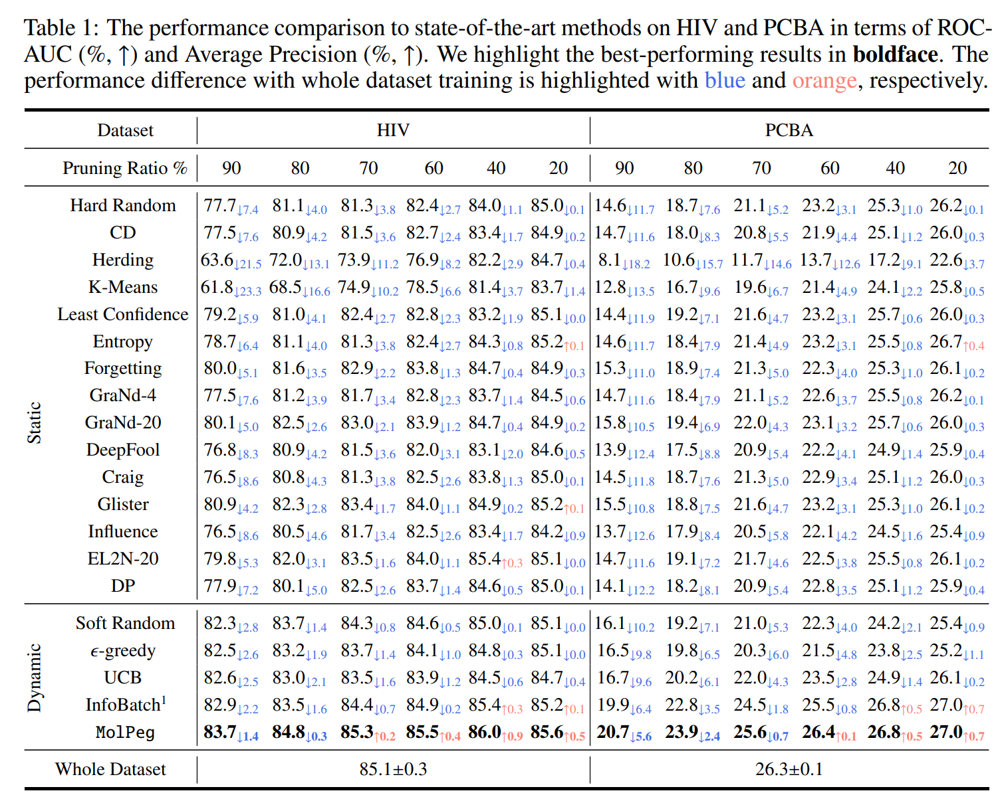
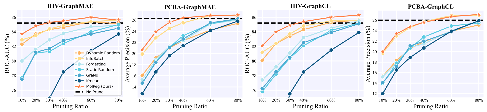

<h1 align="center"> ✂️ Beyond Efficiency: Molecular Data Pruning for Enhanced Generalization </a></h2>
<h5 align="center"> If you like our project, please give us a star ⭐ on GitHub for the latest update.</h5>


<h5 align="center">


    

</h5>

This is the official implementation of the following paper: 

> **Beyond Efficiency: Molecular Data Pruning for Enhanced Generalization (NeurIPS'24)** [[Paper](https://arxiv.org/abs/2409.01081)]
>
> Dingshuo Chen, Zhixun Li, Yuyan Ni, Guibin Zhang, Ding Wang, Qiang Liu, Shu Wu, Jeffrey Xu Yu, Liang Wang

In this work, we propose MolPeg, a plug-and-play data pruning framework  focusing on the source-free data pruning scenario, where data pruning is applied with pretrained models.  It can surpass the performance obtained from full-dataset training, even when pruning up to 60-70% of the data on HIV and PCBA dataset. Our work suggests that the discovery of effective data-pruning metrics could provide a viable path to both enhanced efficiency and superior generalization in transfer learning.


## 🚀 Get Start

This code needs the following requirements to be satisfied beforehand:

```
numpy             1.21.2
scikit-learn      1.0.2
pandas            1.3.4
python            3.7.11
torch             1.10.2+cu113
torch-geometric   2.0.3
transformers      4.17.0
rdkit             2020.09.1.0
ase               3.22.1
descriptastorus   2.3.0.5
ogb               1.3.3
```

### Python environment setup with Conda and pip

```shell
conda create --name MolPeg python=3.7.11
conda activate MolPeg

pip install torch==1.12.1+cu113 torchvision==0.13.1+cu113 torchaudio==0.12.1 --extra-index-url https://download.pytorch.org/whl/cu113

pip install pyg_lib torch_scatter torch_sparse torch_cluster torch_spline_conv -f https://data.pyg.org/whl/torch-1.10.2%2Bcu113.html

pip install -r requirements.txt
```

### **Classification on HIV and PCBA**

Please use the default settings in config.py for unspecified hyperparameters.

```bash
# ratio: [0.1, 0.2, 0.3, 0.4, 0.6, 0.8]
# dataset:       [hiv, pcba]
python main.py --ratio=0.1 --dataset=hiv --pretrain
```


## 🧰 Experimental Results

Our proposed MolPeg are able to achieve significant improvements conbined with several static and dynamic data pruning methods.



Data pruning trajectory given by downstream performance:




## 🤗 Citation

Please consider citing our work if you find it helpful:

```
@article{chen2024beyond,
  title={Beyond efficiency: Molecular data pruning for enhanced generalization},
  author={Chen, Dingshuo and Li, Zhixun and Ni, Yuyan and Zhang, Guibin and Wang, Ding and Liu, Qiang and Wu, Shu and Yu, Jeffrey and Wang, Liang},
  journal={Advances in Neural Information Processing Systems},
  volume={37},
  pages={18036--18061},
  year={2024}
}
```
